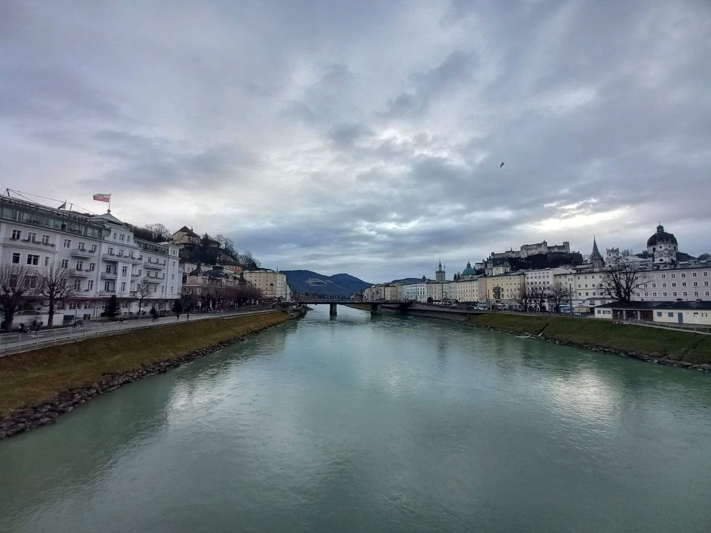
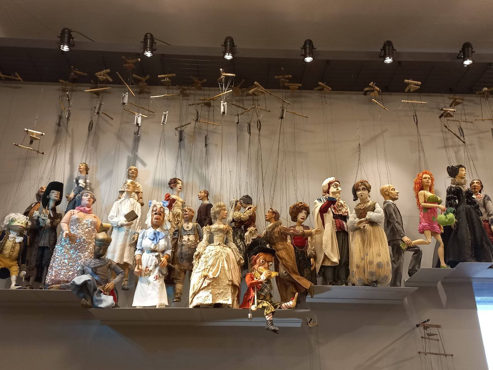
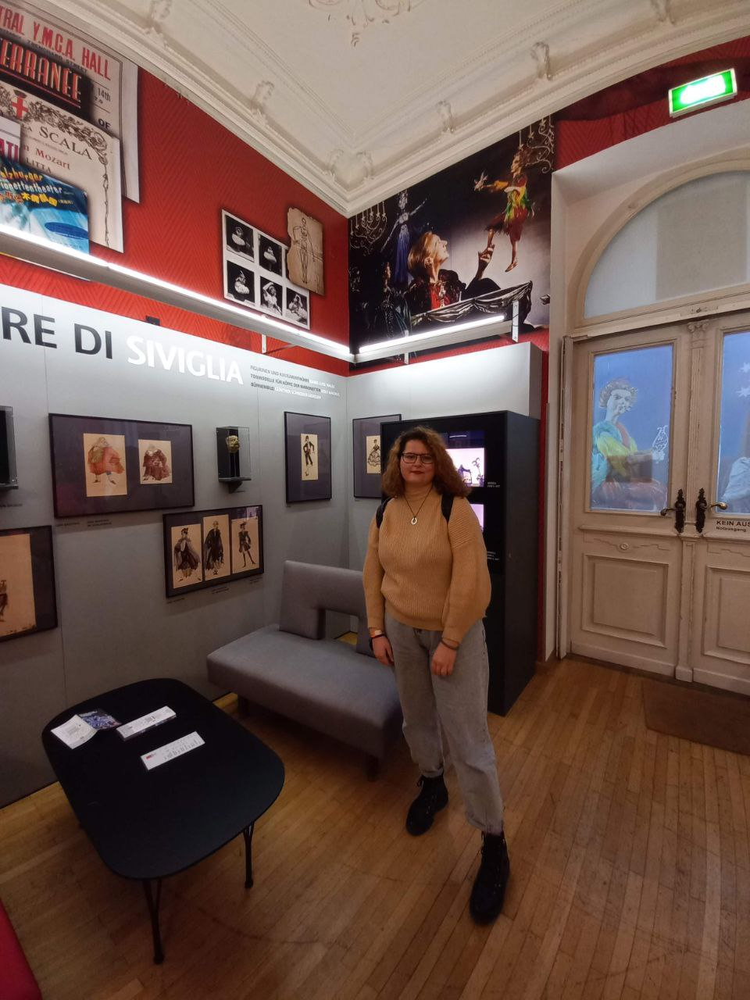
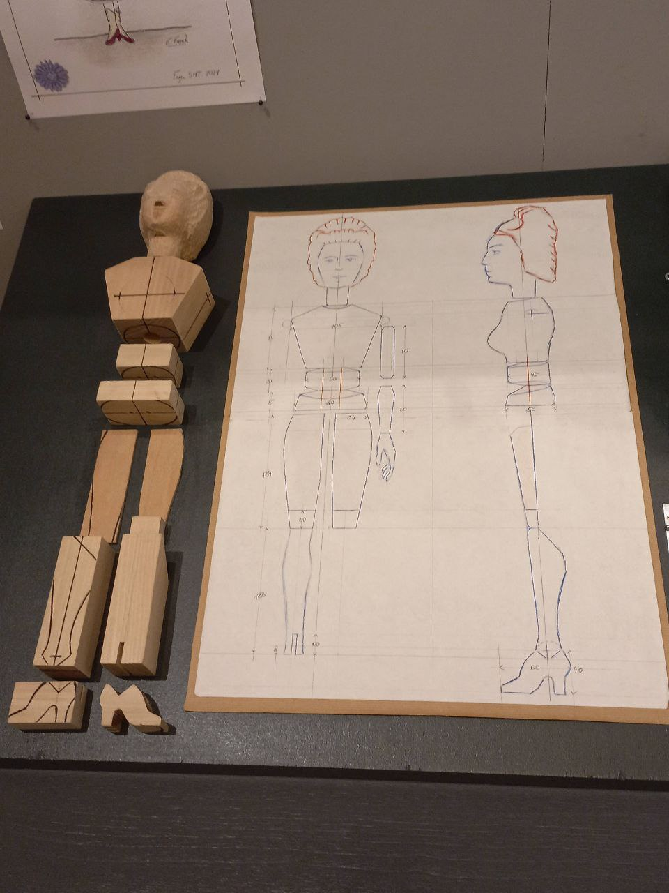
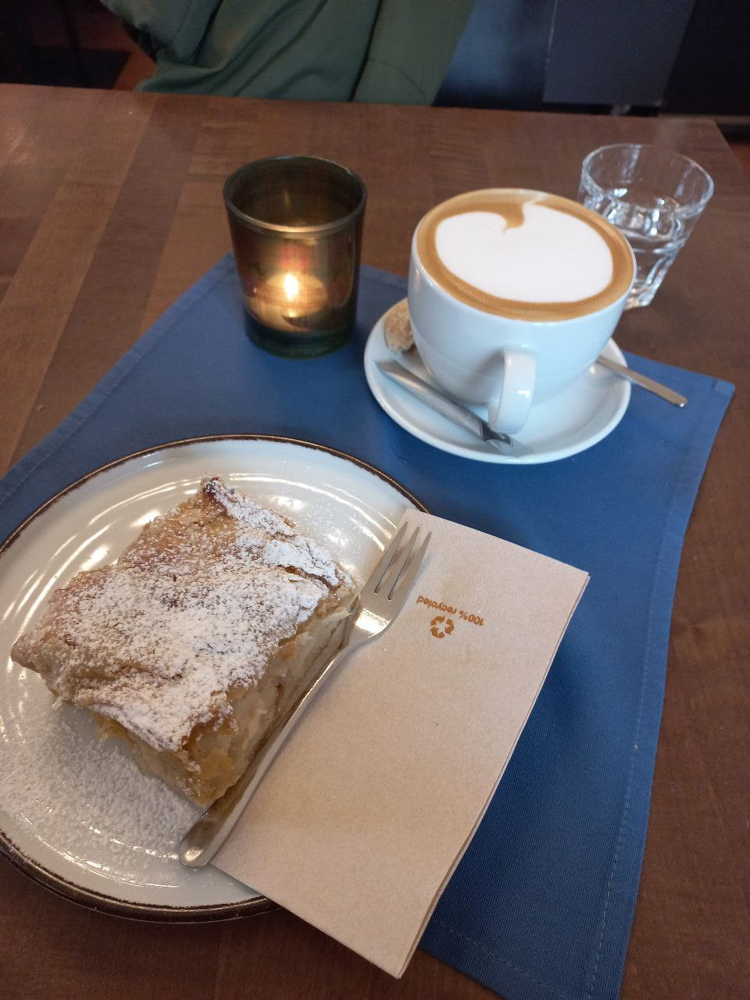

# Salzburg

В 2021-2022 году я проходила обучение в Германии (Бавария) по обмену. На свой день рождения я решила съездить в Зальцбург (Австрия), который настолько запал мне в душу, что я решила выбрать именно эту территорию для лабораторной работы.

Река Зальцах, самый центр Зальцбурга.

# Театр
Зальцбургский театр марионеток - один из старейших действующих театров марионеток в мире. Естественно, я не упустила возможности посетить его - сходла на спектакль Румпельштильцхен (разумеется, была в окружении детей).

 

# Штрудель

Штрудель считается традиционным австрийским десертом, поэтому не попробовать один было бы преступлением. Кстати, раньше тесто для штруделя проверяли раньше с использованием газеты - ее должно быть можно прочитать сквозь текст.

